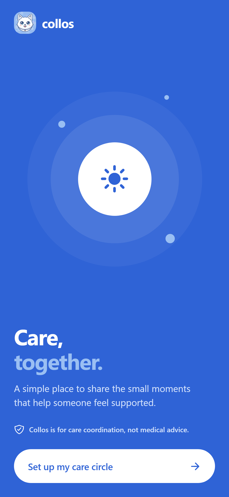
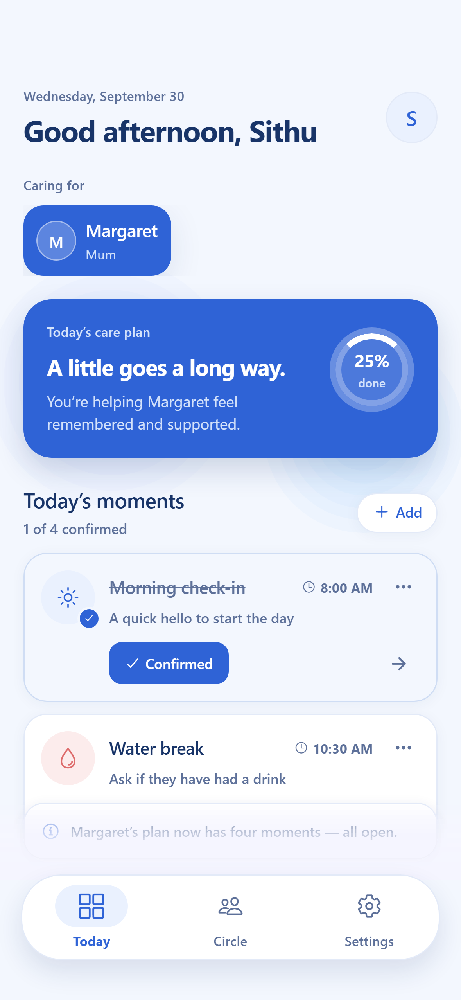
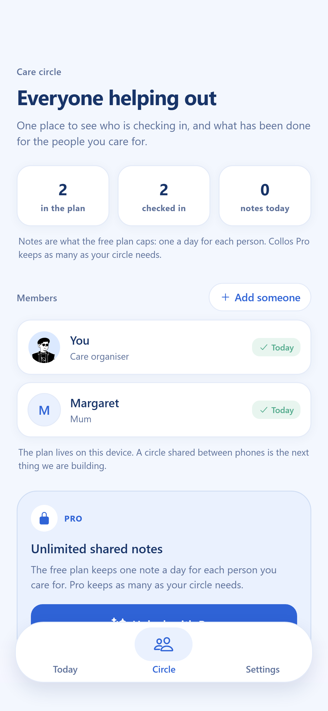
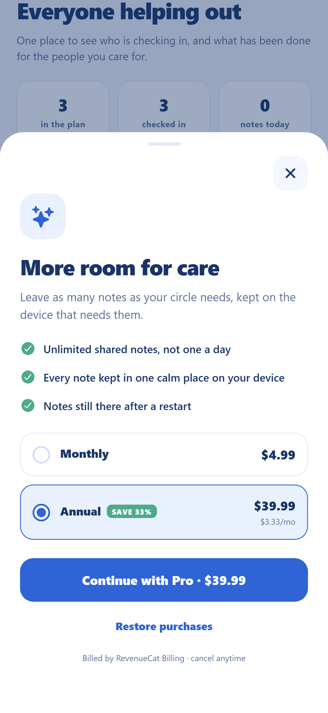
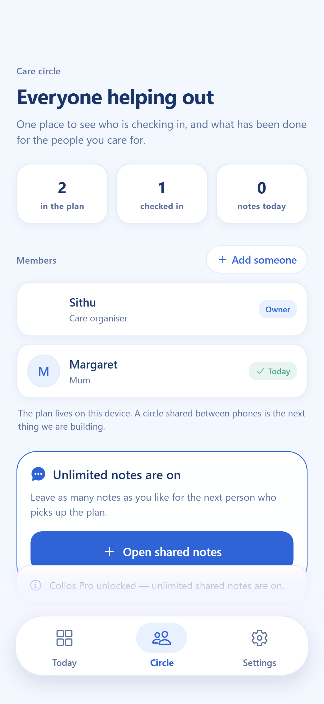
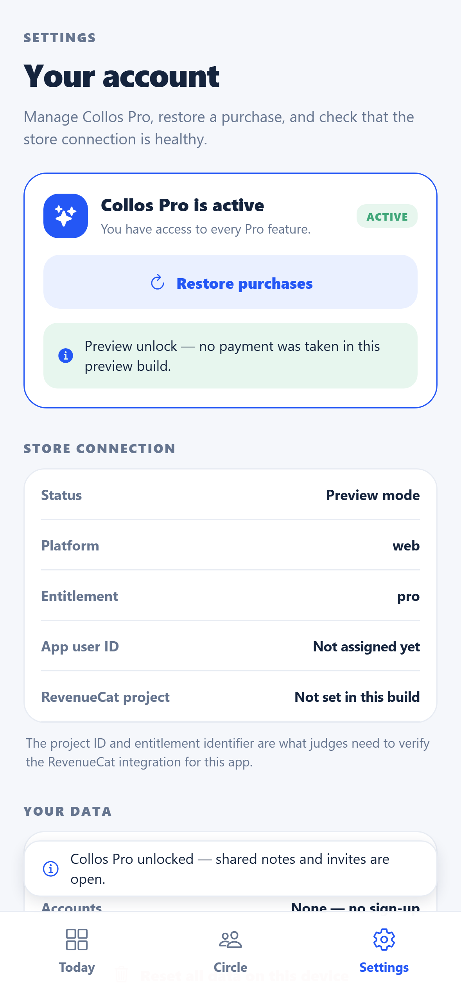
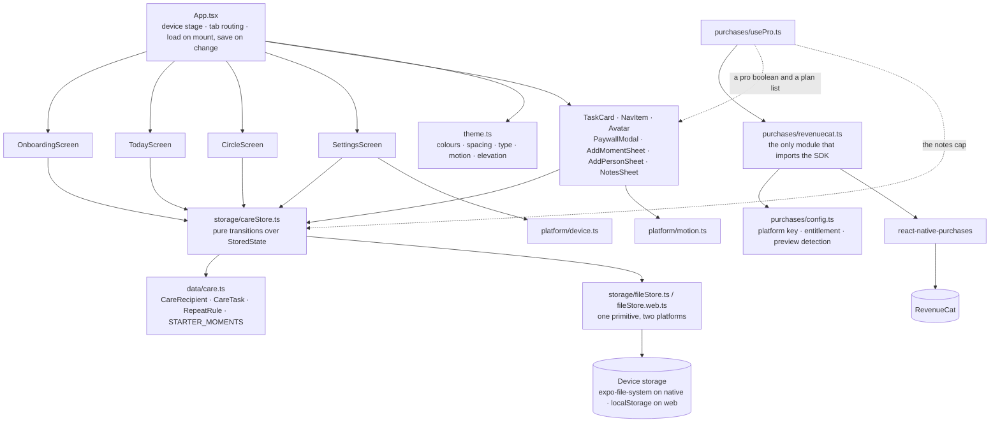
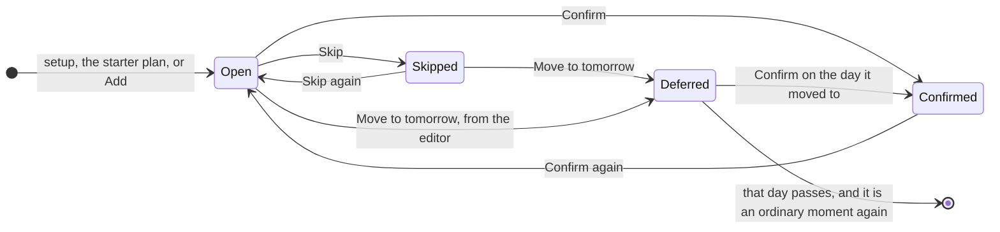
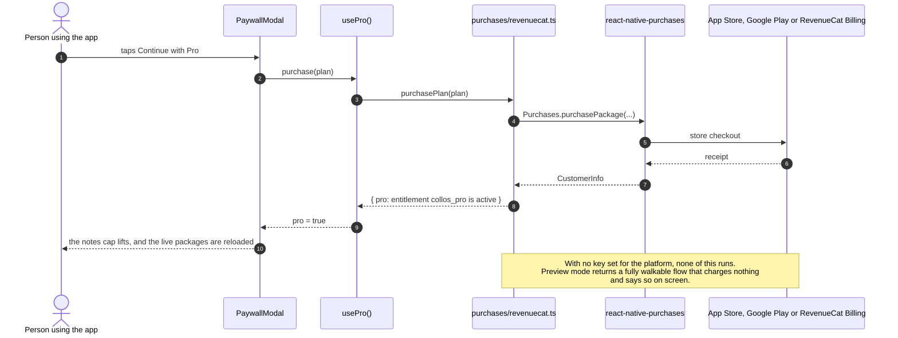

<h1 align="center">
  
  <br />
  Collos
</h1>

<p align="center"><strong>Care, together, for the small things that matter.</strong><br />
A short shared daily plan for the person in a family who has quietly become the organiser.</p>

<p align="center">
  <a href="LICENSE"></a>
  <a href="https://github.com/thesithunyein/collos/actions/workflows/ci.yml"></a>
  
  
  
  
  
  
  
  <a href="CONTRIBUTING.md"></a>
</p>

<p align="center">
  <a href="https://app.collos.sithunyein.com"><strong>Open the live app</strong></a> ·
  <a href="https://collos.sithunyein.com">Project site</a> ·
  <a href="https://collos.sithunyein.com/docs">Docs</a> ·
  <a href="RELEASE.md">Release runbook</a>
</p>

> **Collos is not medical advice.** It coordinates everyday care between people —
> who checked in, who is bringing what, what still needs doing. It holds no
> medical records, offers no diagnosis, and does not replace a qualified care
> professional. In an emergency, contact local emergency services.

> **Status, plainly.** The app is fully working and self-hostable today, and this
> repository is its complete history. It is **not** in the App Store or Google
> Play yet: `RELEASE.md` is the runbook and `eas.json` holds the build profiles,
> so the path is finished, but no listing is live and there is no store URL.
> A care circle shared **between** phones needs a backend and is not built. Both
> of those sentences appear on the marketing site too — nothing in this project
> describes a feature the code cannot do.

---

## Contents

| | | |
| --- | --- | --- |
| [The problem](#the-problem) | [Architecture](#architecture) | [Design system](#design-system) |
| [What Collos does](#what-collos-does) | [Project structure](#project-structure) | [Testing and quality](#testing-and-quality) |
| [What it deliberately does not do](#what-it-deliberately-does-not-do) | [Getting started](#getting-started) | [Screenshots and submission assets](#screenshots-and-submission-assets) |
| [Configuration](#configuration) | [Subscriptions and RevenueCat](#subscriptions-and-revenuecat) | [Deploy](#deploy) |
| [Data, storage and privacy](#data-storage-and-privacy) | [Releasing to the stores](#releasing-to-the-app-store-and-google-play) | [Engineering notes](#engineering-notes-traps-this-project-already-fell-into) |
| [Security](#security) | [Contributing](#contributing) | [Roadmap](#roadmap) |

---

## The problem

Someone in every family becomes the organiser. They are not a nurse and they did
not apply. One sibling does the morning call, another does the shopping, a
neighbour drops by on Thursdays — and the plan for all of it lives in one
person's head, in a group chat, or on a paper note on a fridge.

The failure mode is not dramatic. It is the small, repeating uncertainty:

- **"Did anyone check in this morning?"** — asked by a sibling who does not want
  to call and find out they are the third person to call.
- **"Was that already done, or did I imagine it?"** — the invisible care work
  that never gets credit because it is never recorded.
- **"I can't remember if I asked her about the water."** — the same question,
  asked again, because it was never written down.

The existing tools either want to be a medical record (intimidating, and wrong for
this), or a group chat (fine for talking, useless for knowing what is done). The
gap is not a bigger app. It is a **short, shared, daily plan that survives
restarts** — and it is small enough that today actually happens.

## What Collos does

A care circle around one person, and a plan for today that is short on purpose.

| | |
| --- | --- |
| **Setup** | Name the person you care for, pick a relationship and a face. About ten seconds, no account, no email address, no password. |
| **A plan for today** | Four starter moments — a check-in, a water break, fresh air, an evening note — or add your own. Short enough that a day is finishable. |
| **Confirm, skip, or move it to tomorrow** | Every moment is one tap to confirm. Skipping it is not the end of it: a skipped moment offers **Move to tomorrow** in one tap, and the deferred day is remembered. |
| **Recurring moments** | Any moment can be set to every day, weekdays, or weekends, and today's plan filters on the rule. |
| **Revise anything** | The **⋯** on every row opens an editor: rename it, change the time, change the rule, move it, or delete it (behind a two-tap arm). |
| **A circle that tells the truth** | Who is checked in today, and every note kept on this device — with the organiser's own row marked as the owner rather than counted as a check-in, so the number never flatters itself. |
| **Notes** | One shared note a day per person on the free plan, unlimited with Pro. Written to the same store as the plan, so a note survives a restart exactly like a confirmed moment does. |
| **A real purchase path** | Offerings, purchase, restore and entitlement gating through RevenueCat — one entitlement, `collos_pro`, doing one thing. |
| **Honest numbers** | Progress, counts and stats are derived from stored state on every render. There is no hard-coded "2 of 4" anywhere, and the stats do not count the organiser as a check-in. |

### Screens

Six captures of the running app, at 1179×2556, taken by `npm run screenshots:devpost`.

| Onboarding | Today | Circle (free) |
| --- | --- | --- |
|  |  |  |

| Paywall | Circle (Pro) | Settings |
| --- | --- | --- |
|  |  |  |

## What it deliberately does not do

Every line below is a decision, not a gap that nobody noticed. Each one is also
stated in the app, on the site, or both — a feature that is described but absent
is an App Store rejection, and it is the same drift that once left a stale mockup
on the landing page.

- **No medical anything.** No dosages, no diagnoses, no reminders to take
  medication, no "record symptom" fields. Collos coordinates care; it does not
  practise it. No `Symptom` or `Allergy` field exists, and the paywall is not
  allowed to imply one.
- **No backend, and therefore no shared circle between phones.** The plan lives on
  one device. The honest way to use Collos together today is one device handed
  over, which is exactly what the evening note is for.
- **No reminders or notifications.** They were advertised once, with no
  notification code behind them, and every mention was removed rather than left as
  a promise. Re-adding a line is part of shipping the feature it names.
- **No accounts, no sync, no analytics, no third-party SDKs beyond RevenueCat.**
  Nothing leaves the device.
- **No sample data in the app.** Setup creates the first person and the day starts
  genuinely empty. The only populated plan is one the user asked for.

## Architecture

One React Native codebase, three targets: iOS, Android, and a browser build
through `react-native-web`. There is no state library, no navigation library and
no UI kit — the shell is `App.tsx`, the state is a plain object, and every
transition on it is a pure function.



### How a moment moves through the day

The one behaviour worth reading the code for: a skipped moment is not a lost one.



Three details behind that diagram, all of them in `src/storage/careStore.ts`:

- **A move resets the status to open.** A moment that has been moved has not been
  done, and carrying a `confirmed` across a move would let someone tick a future
  task by skipping a present one.
- **`withDeferredMoment(…, null)` brings it back to today.** The move is a value
  in a map, not a deletion, so it is reversible with the same function.
- **A day that has passed un-defers the moment** rather than losing it. The plan
  filters on the date string, so it reappears on its ordinary rule.

### The purchase path



### Modules

| Module | Responsibility |
| --- | --- |
| `App.tsx` | The shell: the device stage, tab routing, the nav, the paywall, and the wiring that loads state on mount and saves it on every change. |
| `src/screens/` | `OnboardingScreen`, `TodayScreen`, `CircleScreen`, `SettingsScreen`. Each takes its data and its handlers as props; none of them reach for state directly. |
| `src/components/` | `TaskCard`, `NavItem`, `Avatar`, `LaunchScreen`, `PaywallModal`, `AddMomentSheet`, `AddPersonSheet`, `NotesSheet`, `PersonFields`. |
| `src/storage/careStore.ts` | `StoredState` and every transition on it — `withTaskStatus`, `withMoment`, `withEditedMoment`, `withRemovedMoment`, `withDeferredMoment`, `withStarterMoments`, `withResetDay`, `withAddedNote` — plus `FREE_NOTES_PER_DAY` and the day-key helpers. Pure functions: state in, state out. |
| `src/storage/fileStore.ts` / `fileStore.web.ts` | The only platform-specific storage code: `expo-file-system` on native, `localStorage` on web, behind one three-function interface (`read`, `write`, `clear`). |
| `src/data/care.ts` | The vocabulary: `CareRecipient`, `CareTask`, `TaskStatus`, `RepeatRule`, plus `STARTER_MOMENTS`, `PORTRAITS` and `RELATIONSHIPS`. It holds no plan. |
| `src/purchases/config.ts` | Resolves the platform key, the entitlement id (`collos_pro`) and the project id; decides whether payments are configured at all. |
| `src/purchases/revenuecat.ts` | The single boundary with the SDK: init, offerings, purchase, restore, entitlement read, and mapping SDK errors to sentences a person can act on. |
| `src/purchases/usePro.ts` | The hook the UI consumes, so no screen ever imports the SDK. |
| `src/platform/device.ts` | The rows Settings prints — platform, OS, device, React Native runtime, app identifier — read from whichever build is running. |
| `src/platform/motion.ts` | `useReduceMotion()`, so animation can be turned off where the reader asked for that. |
| `src/theme.ts` | Colours, spacing, type, motion, elevation, and the numeric style that gives figures tabular digits. |

### What is on the device

One JSON object per version, written on every change. There is no server-side copy.

```jsonc
{
  "version": 2,
  "seenOnboarding": true,
  "organiserName": "Sithu",
  "activeRecipientId": "person-…",
  "people": [{ "id": "person-…", "name": "Margaret", "relationship": "Mum", "portraitId": "margaret" }],
  "moments": {
    "person-…": [
      { "id": "morning-check-in", "title": "Morning check-in", "time": "8:00 AM", "tone": "sky" },
      { "id": "water-break", "title": "Water break", "time": "10:30 AM", "tone": "blush", "repeat": "weekdays" }
    ]
  },
  "statuses": { "person-…": { "morning-check-in": "confirmed", "water-break": "skipped" } },
  "deferred": { "person-…": { "water-break": "2026-10-01" } },
  "notes": { "person-…": [{ "id": "note-…", "day": "2026-09-30", "text": "She slept badly." }] }
}
```

`version` is checked on read and older payloads are upgraded in place, so a plan
written by an earlier build is not thrown away. **Reset** in Settings clears it,
and the app says out loud that this is permanent, because there is nowhere else
for the data to be.

## Project structure

Every tracked file, with what it is for. `node_modules/`, `dist/` and `.expo/` are
generated and ignored.

```
collos/
├── App.tsx                      the whole shell: stage, tabs, nav, persistence wiring
├── app.json                     Expo config: name, scheme, icons, bundle id com.collos.app
├── eas.json                     build profiles: preview (internal) and production (stores)
├── package.json                 scripts, ten runtime dependencies, three dev dependencies
├── tsconfig.json                TypeScript, strict
├── babel.config.js              the Expo preset, unchanged
├── vercel.json                  builds the browser bundle into dist/ for the app domain
├── tsconfig.json                TypeScript config, strict, no emit
├── package-lock.json            the locked dependency tree CI installs from
├── .env.example                 every environment variable, with empty values
├── .gitignore                   node_modules, dist, .expo, .env*, .vercel
├── brand.md                     the palette, the logo sources, the voice
├── RELEASE.md                   runbook: empty RevenueCat project to a submitted listing
├── SHIPATON.md                  the Shipaton 2026 entry pack: script, form fields, story
├── SECURITY.md                  threat scope, what is out of scope, how to report
├── CONTRIBUTING.md              the verification contract and the honesty rules
├── CODE_OF_CONDUCT.md           how people are expected to behave here
├── LICENSE                      MIT, © 2026 Sithu Nyein
│
├── .github/
│   ├── workflows/ci.yml         typecheck + browser export on every push and PR
│   ├── ISSUE_TEMPLATE/          bug_report.yml · feature_request.yml
│   └── pull_request_template.md the checklist a change has to satisfy
│
├── src/
│   ├── theme.ts                 colours, space, type, motion, elevation, insets
│   ├── data/care.ts             types, starter moments, portraits, repeat rules
│   ├── storage/
│   │   ├── careStore.ts         StoredState and every pure transition on it
│   │   ├── fileStore.ts         native storage: expo-file-system
│   │   ├── fileStore.web.ts     web storage: localStorage
│   │   └── fileStoreKey.ts      the one key both platforms write under
│   ├── purchases/
│   │   ├── config.ts            platform key, entitlement id, preview detection
│   │   ├── revenuecat.ts        the only module that imports the SDK
│   │   └── usePro.ts            the hook the UI consumes
│   ├── platform/
│   │   ├── device.ts            the device rows Settings prints
│   │   └── motion.ts            useReduceMotion()
│   ├── components/              TaskCard.tsx · NavItem.tsx · Avatar.tsx · LaunchScreen.tsx
│   │                            PaywallModal.tsx · AddMomentSheet.tsx · AddPersonSheet.tsx
│   │                            NotesSheet.tsx · PersonFields.tsx
│   └── screens/                 OnboardingScreen.tsx · TodayScreen.tsx
│                                CircleScreen.tsx · SettingsScreen.tsx
│
├── scripts/
│   ├── capture-app-screenshots.mjs   drives the running app and writes every PNG
│   └── check-readme.mjs         lints this file: links, anchors, diagrams, JSON
│
├── tests/
│   ├── careStore.test.mjs       27 behaviour tests over the store's real source
│   ├── smoke.test.mjs           the loader runs src TypeScript in Node (2 tests)
│   └── support/                 load-ts.mjs · hook-cjs.mjs · fileStore-double.mjs
│
├── assets/
│   ├── logo-source.png          the mark, transparent — the source of truth
│   ├── logo-mark.png            the mark on its periwinkle square
│   ├── favicon-source.png      the flat periwinkle square the icons derive from
│   ├── icon.png                 iOS/app icon, generated
│   ├── adaptive-icon.png        Android adaptive foreground, generated
│   ├── favicon.png              browser tab, generated
│   ├── splash.png               splash mark, generated
│   ├── avatars/                 daniel.png · margaret.png · sithu.png — the bundled portraits
│   ├── make-icons.py            resamples the sources into every icon size
│   └── make-og-image.py         composes the 1200x630 social preview card
│
├── landing/                     the static site — no dependencies, no build step
│   ├── index.html               the product page
│   ├── docs.html                the written half: architecture, env, troubleshooting
│   ├── privacy.html             the policy both app stores require
│   ├── terms.html               the terms
│   ├── 404.html                 self-contained, root-absolute, no stylesheet
│   ├── styles.css               one stylesheet for every page
│   ├── script.js                nav, hero depth, pointer light, arrival animation
│   ├── vercel.json              cleanUrls for the site deployment
│   ├── app-*.png                four captures of the running app, one per screen
│   ├── og.png                   the social preview card
│   ├── logo.png                 the header mark
│   ├── logo-mark.png            the mark on its square
│   ├── favicon.png              the tab icon
│   ├── .gitignore               ignores .vercel and .env* for the site deploy
│   └── avatars/                 daniel.png · margaret.png · sithu.png — the site's copies
│
├── submission/
│   └── screenshots/            6 PNGs at 1179x2556 — onboarding, today, circle free,
│                               paywall, circle pro, settings
└── store/
    ├── listing.md               paste-ready store copy and questionnaires
    └── screenshots/
        ├── appstore/           6 PNGs at 1320x2868
        └── playstore/          6 PNGs at 1080x1920
```

## Getting started

### Prerequisites

- **Node.js 18 or newer** (CI runs 20).
- For a native run: the iOS Simulator (macOS), an Android emulator, or the Expo Go
  app on a physical phone.
- Nothing else. No store account, no Apple or Google developer account, and **no
  RevenueCat keys** — see preview mode below.

### Run it

```bash
git clone https://github.com/thesithunyein/collos.git
cd collos
npm install

npm start          # Expo dev server; press w / i / a, or scan the QR code
npm run web        # straight to the browser build
```

The browser build is the fastest way to see the app, and it is a real target
rather than a preview shim: it is the same React Native code through
`react-native-web`, and it is what runs at
[app.collos.sithunyein.com](https://app.collos.sithunyein.com).

### Checks

```bash
npm run typecheck   # tsc --noEmit, strict
npm run build:web   # the export that CI runs
npm test            # behaviour tests over the store's real source
```

`npm test` runs the behaviour suite over `src/storage/careStore.ts` — the real
TypeScript source, loaded into Node by `tests/support/`, with the storage layer
swapped for an in-memory double that honours the same contract. Read
[Testing and quality](#testing-and-quality) for what is verified, and what the
suite deliberately does not cover.

## Configuration

Copy `.env.example` to `.env` and fill in the public SDK keys from your RevenueCat
project. Every value is `EXPO_PUBLIC_*`; every one of them is **public by design**
and ships inside the client. Never put a secret key in this file, and never commit
`.env`.

| Variable | Purpose |
| --- | --- |
| `EXPO_PUBLIC_REVENUECAT_IOS_KEY` | App Store purchases. |
| `EXPO_PUBLIC_REVENUECAT_ANDROID_KEY` | Google Play purchases. |
| `EXPO_PUBLIC_REVENUECAT_WEB_KEY` | Web purchases, billed through RevenueCat Billing (Stripe). Separate from the native keys. |
| `EXPO_PUBLIC_REVENUECAT_ENTITLEMENT` | The entitlement that unlocks Pro. Must match the dashboard; the Collos project uses `collos_pro`, which is also the built-in fallback. |
| `EXPO_PUBLIC_REVENUECAT_PROJECT_ID` | The `proj…` id from the dashboard URL. Shown in the app's Settings screen, which is how it is copied onto a submission form. |

In the RevenueCat dashboard you need: a project, a product per store, an
entitlement named to match `EXPO_PUBLIC_REVENUECAT_ENTITLEMENT`, and a **default**
offering holding a monthly and an annual package.

EAS builds do **not** read the local `.env`. The same five values have to be set as
EAS environment variables per environment, or a store build ships silently in
preview mode.

## Subscriptions and RevenueCat

Subscriptions run through [`react-native-purchases`](https://github.com/RevenueCat/react-native-purchases).
Since SDK 9.7.6 the same SDK covers React Native Web, so the app, the browser
build and the native builds share one entitlements system instead of three.

**Pro sells exactly one thing, enforced in code.** The free plan keeps **one shared
note a day per person** (`FREE_NOTES_PER_DAY` in `src/storage/careStore.ts`); the
entitlement lifts that cap. Nothing else changes, and every line on the paywall
maps to a behaviour you can test on the paywall screen itself.

### Preview mode

If no key is present for the current platform, the app runs in **preview** mode
rather than failing: the purchase flow is fully walkable, and the UI says plainly
that no payment is taken. This is what keeps the public web demo working, and it is
why a contributor needs no keys. Nothing in `src/purchases/` throws — a broken store
connection degrades to preview instead of taking the app down.

### Verifying the integration without buying anything

Settings → **Store connection** prints the state a reviewer needs:

| Row | What a configured build shows |
| --- | --- |
| Status | `Connected` |
| Billing | `RevenueCat Billing` (web) or the store (native) |
| Entitlement | `collos_pro` |
| App user ID | `$RCAnonymousID:…`, assigned by the server |
| RevenueCat project | `projaa1359ce` |

From a locally built web bundle those rows read `Preview mode` instead, because no
keys are compiled in. That difference is deliberate and documented in
[`SHIPATON.md`](SHIPATON.md): the frames used for evidence are captured against
production, and the one frame that needs Pro active is captured in preview mode and
labelled as such.

`react-native-purchases` contains native code, so a real purchase needs a
development build (`npx expo install expo-dev-client`, then `eas build`). Inside
Expo Go the SDK falls back to JavaScript-level behaviour, which is enough to check
the UI and the entitlement logic. Restore purchases is not supported on the web at
all, and the app says so instead of showing a confusing failure.

## Data, storage and privacy

- **The plan is written the moment it changes.** Every confirmation, added moment,
  edit, move, deletion and note goes to device-local storage — `localStorage` in
  the browser, `expo-file-system` on a phone — through three functions in
  `src/storage/fileStore.ts` and `src/storage/fileStore.web.ts`.
- **There is no backend.** No account, no sync, no analytics, no crash reporting,
  no third-party SDK other than RevenueCat, and no `fetch` to anywhere in the app.
- **Deleting the app deletes the data.** There is no copy anywhere else, which is
  the privacy answer and the data-loss warning at the same time. The app says so,
  the FAQ says so, and the terms say so.
- **The organiser is not counted as a check-in.** The circle screen marks their own
  row as the owner and counts only real confirmations, because a stat that includes
  the person holding the phone would always look better than it is.

## Design system

The app and the site share one palette and one type family on purpose: it is what
lets a capture of the running app sit inside the page that describes it without
either looking borrowed. `src/theme.ts` is the source for the app,
`landing/styles.css` repeats the same values as CSS variables, and `brand.md`
holds both plus the reasoning.

### Palette

Every value was read off the logo, so the mark and the interface cannot drift.

| Token | Value | Used for |
| --- | --- | --- |
| Collos blue | `#2F63D6` | Primary action, brand accents, the hero card |
| Ink navy | `#183468` | Headings, high-emphasis text |
| Periwinkle | `#9ABFF3` | Fills on brand blue, the logo's own square |
| Blush | `#DD6B6B` | The heart on the cat's tag; notes and skipped states |
| Muted slate | `#5D7099` | Supporting copy |
| Soft cloud | `#F3F7FE` | App background |
| Backdrop | `#EDF3FE` | The surround behind the device frame on wide screens |
| Semantic mint | `#4FA98A` | Completed care moments |
| Lilac | `#7B76DE` | The fourth moment tone, kept distinct from the blues |
| Semantic red | `#C75353` | Recoverable errors only |

### Tokens

`src/theme.ts` exports one scale per axis, and screens read from it rather than
from raw numbers: `space`, `type`, `motion`, `shape`, `elevation`, `insets`, and
`numeric` — the last being the tabular-figures style every number is set in, so a
progress value does not jitter as it counts.

### Accessibility

- **Reduce motion is honoured everywhere**, through `useReduceMotion()`: entrance
  animations, the drifting light on the landing page and the sheet transitions all
  stop, and the pointer listeners are never attached at all.
- **Text scales, within a bound.** Nav labels and pills cap
  `maxFontSizeMultiplier` so a large system font cannot break a row, and rows are
  laid out to survive the rest.
- **Every control is announced.** The **⋯** and skip buttons are icon-only, and
  each carries an `aria-label` naming the moment it acts on — including the
  two-tap delete, which announces that it is armed before it will delete.
- **The tab bar says which tab is selected** to assistive technology, not only in
  colour: `aria-selected` is set explicitly, because `accessibilityState` on a
  `tab` role is not translated by `react-native-web`.
- **No medical colour-coding.** Mint means a moment is done. It never means a
  person is well.

### Why the type changed

The first version of this app set **51 styles at weight 800 and six at 900**
against two at 600, and put uppercase letterspaced micro-labels on four different
screens. That combination is the visual signature of a generated UI: every element
shouts at the same volume, so nothing has hierarchy and the eye finds no calm
surface.

The range is now 600 for row titles and labels, 700 for screen titles, numbers and
the one hero card, and nothing above it. Uppercase labels became sentence case
(`Care circle`, `Members`, `Store connection`), and display sizes came down with
them — screen titles 27 to 25, section titles 20 to 18, the hero card title 22 to 19.

The other half of "this looks generated" is **density**, which is a product
decision rather than a styling one. Today carried a greeting, a switcher, a hero
card, a section header with two actions, four moment cards each with two bordered
buttons, a notes row, a Pro row and a medical disclaimer — eight buttons on one
screen, plus a control that wipes the day sitting as a peer of the one button
people actually press. Four things moved or went:

| Was on Today | Where it is now |
| --- | --- |
| A second bordered `Skip` button on every moment card | An icon-only control pinned to the card's trailing edge. The action is unchanged and still announced to a screen reader; only the chrome went. |
| `Reset day`, beside `Add` | Settings, under "Your data", directly above the destructive reset — the reversible one and the destructive one are only distinguishable side by side. |
| The medical disclaimer | Settings, where the same sentence already runs on onboarding, the FAQ, the footer and the docs page. |
| A Pro row 18px below the notes row | The same row below a dashed rule, so the plan's own rows stop reading as one monetisation stack. |

The trade to be aware of: an icon-only **Skip** is less discoverable than a
labelled button, and it is a deliberate bet that one primary action per row reads
better than two.

## Testing and quality

A behaviour suite now exists, and it is deliberately small and deliberately
honest about what it does not cover: the React screens are not rendered in a
test, and nothing here is a UI test. What `src/storage/careStore.ts` *does* —
the part of the app that decides what a moment is, when it appears, and what
skipping it means — is tested against its real source:

```bash
npm test    # 29 tests, Node's built-in runner, zero new dependencies
```

The suite runs the shipping TypeScript directly — a module loader strips types
with the app's own `typescript` devDependency, so there is no build step and no
copy of the code that could drift — and pins the behaviours the app's promises
depend on: a move resets a status, a skipped moment reappears when its day
arrives, an edit keeps its id so a rename cannot untick, a corrupt payload reads
as no state, a failed write never throws. What *is* verified beyond it, and how:

| Check | Command | What it proves |
| --- | --- | --- |
| Behaviour | `npm test` | The store's real TypeScript in Node, storage swapped for a contract-identical in-memory double: recurrence, the deferred map, edit/remove/defer transitions, the never-throws storage guarantees, the one-note-a-day limit. |
| Types | `npm run typecheck` | Strict TypeScript across the app: imports resolve, props line up, the stored-state shape has not drifted. |
| Browser bundle | `npm run build:web` | The app exports for the target with no native code behind it — the one that breaks first when a dependency drifts. This is also what catches the `expo-font` trap. |
| Screens | `npm run screenshots` | The capture script drives the real app the way a person does — setup, the starter plan, confirm, and the moment editor — and fails if a screen never reaches the state it is supposed to photograph. That makes it a smoke test with a useful side effect. |
| Server state | Settings → Store connection | A production build prints `Connected`, `collos_pro`, `projaa1359ce` and a server-assigned `$RCAnonymousID`, none of which can be produced by a mock. |
| Persistence | Manual | Confirm a moment, close the tab, reopen it: the confirm is still there, because the payload is written on change. |

The typecheck, the behaviour suite and the export are the CI job
([`.github/workflows/ci.yml`](.github/workflows/ci.yml)), so they run on every push
and every pull request.

The suite's limits are stated in its own file: the React screens are not
rendered in a test, and the storage double stands in for `expo-file-system` and
`localStorage` behind the same three-function contract. Extending it follows
[CONTRIBUTING.md](CONTRIBUTING.md) — name the behaviour in the test title, and
run the real source through `tests/support/load-ts.mjs` rather than a copy.

## Deploy

Both deployments are Vercel, and neither needs a secret in the repository.

### The browser app

```bash
npm run build:web          # expo export --platform web, into dist/
```

The repository-root `vercel.json` runs that command and serves `dist/`. In Vercel,
import the repository with **Root Directory** `.` and the **Other** framework
preset, add `app.collos.sithunyein.com` under **Project Settings → Domains**, and
create the DNS record Vercel gives you. Web purchases bill through RevenueCat
Billing, so a configured `EXPO_PUBLIC_REVENUECAT_WEB_KEY` makes the browser build
take real subscriptions; without it the build stays in preview mode.

### The project site

The site has no dependencies and no build step, which is why it lives in `landing/`
and deploys on its own.

```bash
cd landing && vercel --prod
```

In Vercel: **Root Directory** `landing`, **Other** preset, no build command, `.` as
the output directory, then add `collos.sithunyein.com`. `landing/vercel.json` sets
`cleanUrls`, so the docs page resolves at `/docs` and the legal pages without
`.html`. A domain is not claimed as live here until Vercel reports the deployment
ready and the domain resolves.

To preview the site locally, serve the directory (`python -m http.server 8123
--directory landing`) — opening `index.html` from the filesystem works for the
markup but not for the root-absolute links.

## Screenshots and submission assets

Every phone frame in this repository is a capture of the running app, taken by
`scripts/capture-app-screenshots.mjs`. Nothing is drawn by hand, and the populated
plan in the images is one the tour actually created rather than one the build ships
with — because the hero of the landing page *used to be* a hand-built impression of
the plan screen, and it kept advertising a percentage the app had stopped showing.

The script launches local Chrome or Edge headless, drives the web app over the
DevTools protocol, and writes the PNGs. It has no npm dependencies and needs no
secrets.

```bash
npm run screenshots            # landing/ — the frames the site shows
npm run screenshots:devpost    # submission/screenshots/ — 1179x2556
npm run screenshots:appstore   # store/screenshots/appstore/ — 1320x2868
npm run screenshots:playstore  # store/screenshots/playstore/ — 1080x1920
```

Useful flags:

| Flag | Why it exists |
| --- | --- |
| `--base-url http://localhost:8081` | Capture against a local build instead of production. A local build has no keys, so its Settings screen shows preview mode — useful for UI work, useless as evidence. |
| `--only 04-paywall` | Run the tour only as far as the screens named, and write only those. This is how the paywall shot is taken against production without completing a live checkout. |
| `--skip-pro` | Drops the paywall and the Pro steps, because *Continue with Pro* hands off to a real RevenueCat Billing checkout that a headless browser cannot finish. |
| `--set landing` | The four frames the site uses, one per screen. |

**The six frames do not all come from the same build, and the split is deliberate:**

```bash
node scripts/capture-app-screenshots.mjs --set devpost --skip-pro                # 01, 02, 03, 06 from production
node scripts/capture-app-screenshots.mjs --set devpost --only 04-paywall         # the live offering
node scripts/capture-app-screenshots.mjs --set devpost --base-url http://localhost:8081 --only 05-circle-pro
```

Five of the six come from `app.collos.sithunyein.com`, because that is the only
place the Settings screen can show a real store row: a local build renders
`Preview mode`, `collos_pro` and `RevenueCat project: Not set in this build`, which
is no evidence of anything. The Pro-state frame is the exception — unlocking Pro
against production means finishing a real card checkout, so it is captured from a
preview build where the unlock is simulated, and the app labels that state on
screen rather than hiding it.

Store sizes are **not** interchangeable with each other: App Store Connect rejects a
set that skips the largest supported display, which is why 1179×2556 is not
accepted there, and Google Play refuses any screenshot whose longest side exceeds
twice its shortest, which rules out both 1179×2556 and 1320×2868. See
[`store/listing.md`](store/listing.md) §5.

Icons and the social card are generated from the same two source images:

```bash
python assets/make-icons.py      # app icon, adaptive icon, both favicons, splash mark
python assets/make-og-image.py   # landing/og.png, 1200x630
```

`make-icons.py` only ever *resamples* the supplied logo; it never draws it. The
generator it replaced could regenerate a placeholder heart over the real mark — a
trap worth not repeating. The social card exists because a link preview crops to
about 2:1, and a portrait phone screenshot served to one arrives as the middle of
an unlabelled screen.

The site also carries the `privacy` and `terms` pages both app stores require,
linked from the footer of every page.

Use `--only` to run a single frame before a full set. The tour throws
`Never reached <step>` rather than photographing a screen it could not actually
reach, so a wrong step name fails loudly on one screenshot instead of quietly
producing six frames with one of them wrong.

## Releasing to the App Store and Google Play

**No listing is live.** Everything needed to submit is in the repository; the
account work is not done. Say so before quoting a release date to anyone — a first
App Store review is typically days, and a first Google Play review of a new
developer account can take longer.

[`RELEASE.md`](RELEASE.md) is the full runbook, from an empty RevenueCat project to
a submitted listing, including the mistakes this project has already made once.
[`store/listing.md`](store/listing.md) holds the paste-ready copy and the privacy,
data-safety and age-rating answers.

| File | What it does |
| --- | --- |
| `eas.json` | A `preview` profile for internal distribution and a `production` profile that auto-increments build numbers. |
| `app.json` | `ios.buildNumber`, `android.versionCode`, the `collos` scheme, and the export-compliance answer so the App Store encryption question needs no manual step. |
| `store/listing.md` | Store metadata, pre-flight gates, questionnaires. |
| `RELEASE.md` | The runbook, including the traps in §10. |

```bash
npm run release:preview     # internal build you can hand to someone
npm run release:ios         # App Store build
npm run release:android     # Google Play build
npm run submit:ios          # upload to App Store Connect
npm run submit:android      # upload to Google Play
```

## Engineering notes: traps this project already fell into

Kept because each one cost an afternoon, and a comment that records a trap is
worth more than one that restates the line beneath it.

1. **A floated `expo-font` blanks the web build.** `@expo/vector-icons` declares
   `expo-font` as a wildcard peer dependency, so a floating range resolves to the
   newest release, and a newer `expo-font` calls `registerWebModule`, which does not
   exist in SDK 51's `expo-modules-core`. The bundle then builds successfully and
   throws at runtime, leaving a blank white page. `expo-font` is pinned to
   `~12.0.10` and additionally held by an `overrides` entry. Move `expo`,
   `expo-font` and `@expo/vector-icons` together, or not at all.
2. **Centring with `transform` breaks a `rotate` animation on the same element.**
   The individual transform properties compose with `transform` rather than
   replacing it, and `transform` is applied innermost — so a
   `translate(-50%, -50%)` written there is rotated along with everything else, and
   the element orbits its own anchor instead of turning on the spot. Centre with the
   `translate` property and let `transform` carry only the movement.
3. **A `fill-mode: both` opacity animation silently overwrites the declared
   opacity.** Ending a fade on `opacity: 1` made a 40%-opacity layer paint at full
   strength. Each layer animates to its own `--fade-to` value instead.
4. **A capture script can only press what it can name.** The element finder tested
   `innerText || aria-label`, which meant an icon-only control — every **⋯** — was
   unreachable because the fallback never ran. Testing both ways fixed it.
5. **An unrun gate is not a gate.** The landing page's arrival animation was on an
   `IntersectionObserver` that never reported in one environment, which left every
   section below the fold at `opacity: 0` forever. It now sweeps on scroll, and the
   classes that hide content are added by script rather than written in markup, so
   a reader without JavaScript gets a fully composed page.
6. **A date key must be local.** `toISOString()` shifts the day for anyone east of
   UTC, which moves the plan under the user at 5pm. `dayKey()` builds `YYYY-MM-DD`
   from local parts, and dates are compared as strings, which sorts
   chronologically with nothing to parse and no timezone to get wrong.

## Security

There is no backend, no account and no server-side data, so the honest threat model
is a device, not an API. The full policy — scope, what is explicitly *not* a
vulnerability, and how to report — is in [`SECURITY.md`](SECURITY.md). In short:

- The `EXPO_PUBLIC_REVENUECAT_*` values are **public SDK keys**, designed to ship in
  a client; the app rejects secret keys by design. A secret key in this repository
  would be a critical finding; a public one in the bundle is the intention.
- `.env` and every `.env.*` file is ignored, and `.env.example` contains comments and
  empty values only.
- Report anything exploitable to **sithunyein.mailto@gmail.com** with the subject
  `SECURITY — Collos`, not in a public issue.

## Contributing

Ideas, bug reports and pull requests are welcome. The two things that matter here
are **run the checks** and **do not describe anything the code does not do**;
[`CONTRIBUTING.md`](CONTRIBUTING.md) states the full contract, the house style, and
the rules this project holds itself to. By taking part you agree to the
[code of conduct](CODE_OF_CONDUCT.md).

A pull request is ready when `npm run typecheck` is clean, `npm run build:web`
succeeds, and any screen whose layout changed has had its captures re-run and
committed with the change.

## Roadmap

In order, and each one is a real piece of work rather than a slogan:

1. **A shared circle between phones.** A backend, and the only thing standing
   between this and the product the site describes. The storage module is the seam
   it plugs into — `careStore` is pure transitions over a plain object, so the UI
   does not change.
2. **Scheduled reminders.** Deliberately advertised nowhere until the notification
   code exists. `expo-notifications` plus the store's notification declarations.
3. **A test suite.** Starting with the pure functions in `careStore.ts`.
4. **Store listings.** The runbook is written and the build profiles exist; what is
   missing is the account work and the reviews.
5. **More than one plan a day.** Weekly and monthly views of what has been done,
   for the person who wants to see that the small things added up.

## License

[MIT](LICENSE) © 2026 Sithu Nyein. Use it, fork it, run it for your own family.

## Acknowledgements

- [Expo](https://expo.dev) and [React Native](https://reactnative.dev) — one
  codebase, three targets, no native modules written by hand.
- [RevenueCat](https://www.revenuecat.com) — the reason a purchase, a restore and
  an entitlement do not need a bespoke subscription service.
- [Vercel](https://vercel.com) — both deployments.
- [DM Sans](https://fonts.google.com/specimen/DM+Sans) and
  [Material Symbols](https://fonts.google.com/icons) on the site.
- The cat is drawn by hand, and the logo is the source of truth for every icon,
  every colour and every size in this project.
